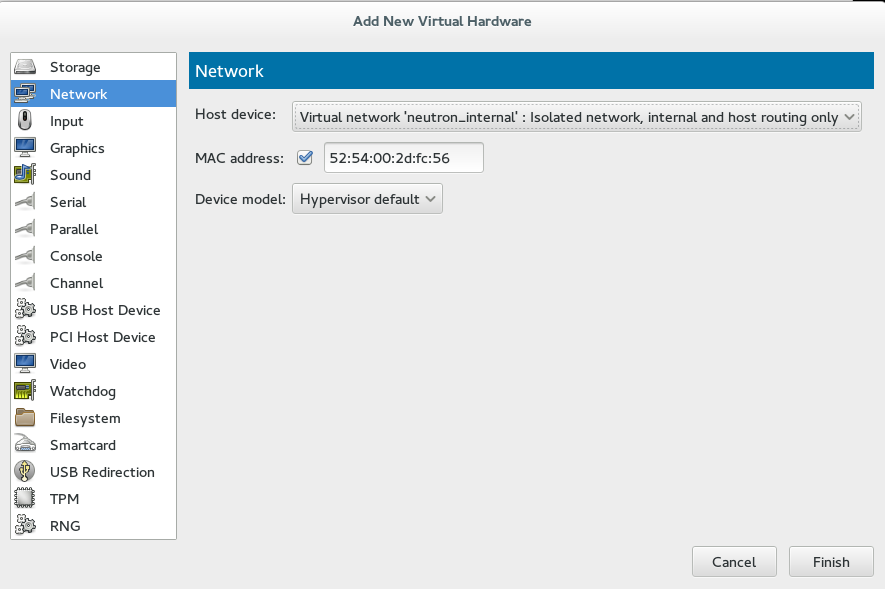

# Enabling live migration without shared storage

---

## Setup with virt-manager on Fedora 20

---

## create an internal network in virt-manager

---

## nested virt setup with libvirt and virt-manager

Set up four CentOS or RHEL 6.5 instances:

 * horizon - 1GB mem/8GB disk
 * neutron - 1GB mem/8GB disk
 * nova-1 - 3GB mem/12GB disk
 * nova-2 - 3GB mem/12GB disk

---

## instance network interfaces

Each instance needs an additional network interface for the internal network

---

## start instances and set up networking

in `/etc/sysconfig/network-scripts/ifcfg-eth1`:

    DEFROUTE=no
    PEERDNS=no
    PEERROUTES=no
    ONBOOT=yes

---
## check eth0 as well

in `/etc/sysconfig/network-scripts/ifcfg-eth0`:

    ONBOOT=yes

After this you can start both interfaces and ensure you have IPs that look sane on `eth0` and `eth1`

---

## run through packstack setup

Get to the point where you can fire up a cirros instance.

---

## Configure Nova

Set the following in `/etc/nova/nova.conf` on your compute nodes:

    vncserver_listen = 0.0.0.0
    live_migration_flag = VIR_MIGRATE_UNDEFINE_SOURCE,VIR_MIGRATE_PEER2PEER,VIR_MIGRATE_LIVE

...and restart all nova services (`openstack-service restart nova`).

---

## Configure libvirt

Set the following in `/etc/libvirt/libvirtd.conf`:

    listen_tcp=1
    listen_tls=0
    dynamic_ownership=0
    auth_tcp="none"
    listen_addr="0.0.0.0"

Note: there is also an `/etc/libvirt/libvirt.conf` which is not the correct file.

---

## Enable libvirtd networking

In `/etc/sysconfig/libvirtd`, set:

    LIBVIRTD_ARGS="--listen"

...and restart `libvirtd`.

---

## Firewall stuff

Run:

    iptables -I INPUT -p tcp -m tcp --dport 49152:49216 -j ACCEPT 
    iptables -I INPUT -p tcp -m tcp --dport 16509 -j ACCEPT 
    iptables-save > /etc/sysconfig/iptables

---

## Migrate an instance

You will only be able to migrate instances started *after* making
these changes.  Then:

    nova live-migration --block-migrate <instance> <compute host>

---

# troubleshooting

If there are issues when migrating, check out the libvirtd logs on both compute nodes.

