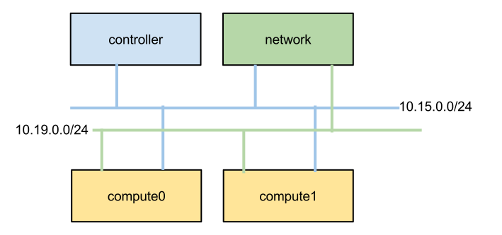
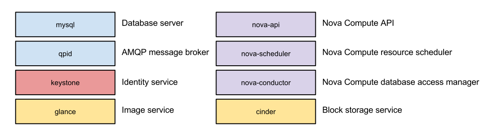
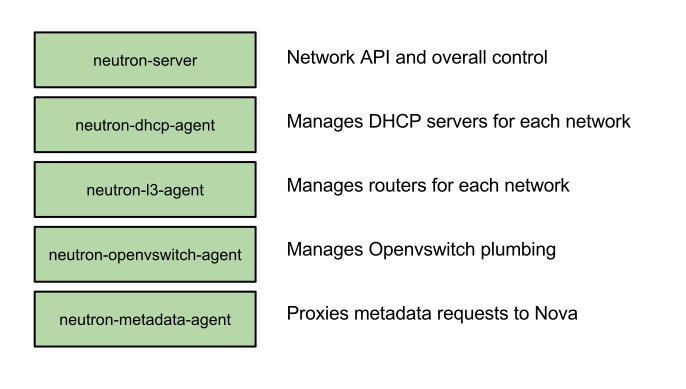
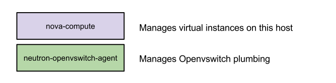
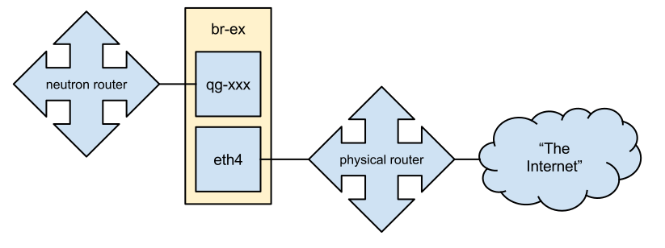

# RDO Hangout: Multinode OpenStack with Packstack

February 27, 2014  
Lars Kellogg-Stedman <lars@redhat.com>

http://goo.gl/Yvmd0P

---

## What are we going to do today?

A multinode OpenStack install using packstack

- One controller
- One network host
- Two compute hosts

---

## Our tools

- [CentOS] 6.5
- [RDO] Havana
- [Packstack][]

[centos]: http://www.centos.org/
[rdo]: http://openstack.redhat.com/
[packstack]: https://wiki.openstack.org/wiki/Packstack

---

## What is packstack?

A command-line tool for automating the deployment of simple OpenStack
clouds.

- Single host (`--allinone`) or multinode
- Proof of Concept ("PoC") deployments

Not really designed for production use:

- Servers must be pre-installed
- No high-availability
- No scalability
- No shared filesystems

Supported platforms

- RHEL
- CentOS
- Fedora

---

---

## Architecture Overview

Specifically:

- Neutron networking
- OpenVswitch plugin
- GRE tenant networks

---

## Controller host

---

## Network host

---

## Compute host

---

# Getting started

---

## Set up ssh

Make sure that you can ssh as `root` to all your hosts from wherever
you're running `packstack`.

---

## Install packstack

Make the RDO repositories available:

    # yum install -y http://rdo.fedorapeople.org/rdo-release.rpm

And install `packstack`:

    # yum -y install openstack-packstack

---

## The answers file

You can set all sorts of parameters on the command line...

    packstack --allinone --os-quantum-install=y --provision-demo=n \
      --provision-all-in-one-ovs-bridge=n

...but I like to generate an "answers" file and edit it:

    # packstack --gen-answer-file packstack-answers.txt

For this hangout, our `packstack-answers.txt` file differs from the
default like this:

    CONFIG_CEILOMETER_INSTALL=n
    CONFIG_NOVA_COMPUTE_HOSTS=10.15.0.2,10.15.0.8
    CONFIG_NEUTRON_SERVER_HOST=10.15.0.7
    CONFIG_NEUTRON_L3_HOSTS=10.15.0.7
    CONFIG_NEUTRON_DHCP_HOSTS=10.15.0.7
    CONFIG_NEUTRON_LBAAS_HOSTS=10.15.0.7
    CONFIG_NEUTRON_METADATA_HOSTS=10.15.0.7
    CONFIG_NEUTRON_OVS_TENANT_NETWORK_TYPE=gre
    CONFIG_NEUTRON_OVS_TUNNEL_RANGES=1000:3000
    CONFIG_NEUTRON_OVS_TUNNEL_IF=eth2

`CONFIG_NEUTRON_OVS_TUNNEL_IF` is used to configure
the source ip address for GRE tunnels via the Facter fact
`ipaddress_<interfacename>` (e.g., `ipaddress_eth2`).

---

# Run packstack

---

<!-- -->

    # packstack --answer-file packstack-answers.txt
    Welcome to Installer setup utility
    Packstack changed given value  to required value /root/.ssh/id_rsa.pub

    Installing:
    Clean Up...                                            [ DONE ]
    Setting up ssh keys...                                 [ DONE ]
    Discovering hosts' details...                          [ DONE ]
    Adding pre install manifest entries...                 [ DONE ]
    Adding MySQL manifest entries...                       [ DONE ]
    Adding QPID manifest entries...                        [ DONE ]
    Adding Keystone manifest entries...                    [ DONE ]
    Adding Glance Keystone manifest entries...             [ DONE ]
    Adding Glance manifest entries...                      [ DONE ]
    Installing dependencies for Cinder...                  [ DONE ]
    Adding Cinder Keystone manifest entries...             [ DONE ]
    .
    .
    .

<!-- -->

    Finalizing...                                          [ DONE ]

     **** Installation completed successfully ******
    
    
    Additional information:
     * Time synchronization installation was skipped. Please note that unsynchronized time on server instances might be problem for some OpenStack components.
     * Did not create a cinder volume group, one already existed
     * File /root/keystonerc_admin has been created on OpenStack client host 10.15.0.4. To use the command line tools you need to source the file.
     * To access the OpenStack Dashboard browse to http://10.15.0.4/dashboard.
    Please, find your login credentials stored in the keystonerc_admin in your home directory.
     * The installation log file is available at: /var/tmp/packstack/20140226-155910-suyHHe/openstack-setup.log
     * The generated manifests are available at: /var/tmp/packstack/20140226-155910-suyHHe/manifests

---

## What just happened?

- Lots of packages installed
- Configuration in `/etc/{nova,glance,cinder,neutron,...}/`
- Firewall rules for all services
- MySQL users and databases created
- Services started

---

# Post-install Configuration

---

## Fix Horizon

You may need to fix [ALLOWED_HOSTS][]:

    # sed -i '/^ALLOWED_HOSTS/ s/=.*/= [ "*" ]/' \
      /etc/openstack-dashboard/local_settings 
    # service httpd restart

[ALLOWED_HOSTS]: https://docs.djangoproject.com/en/1.5/ref/settings/#allowed-hosts

---

Source your `admin` credentials:

    # . /root/keystonerc_admin

Create a disk image:

    glance image-create \
      --copy-from http://download.cirros-cloud.net/0.3.1/cirros-0.3.1-x86_64-disk.img \
      --is-public true \
      --container-format bare \
      --disk-format qcow2 \
      --name cirros

---

Create external network:

    # neutron net-create external --router:external=True
    # neutron subnet-create --disable-dhcp external 172.16.13.0/24

---

Create a flavor for testing:

    # nova flavor-create m1.nano auto 128 1 1

This flavor consumes minimal memory and disk so it is better than the
default flavors for testing in constrained environments.

---

Create a non-admin user:

    # keystone tenant-create --name demo
    # keystone user-create --name demo --tenant demo --pass demo

And store the credentials in `/root/keystonerc_demo`:

    export OS_USERNAME=demo
    export OS_TENANT_NAME=demo
    export OS_PASSWORD=demo
    export OS_AUTH_URL=http://10.15.0.7:35357/v2.0/
    export PS1='[\u@\h \W(keystone_demo)]\$ '

---

## Switch credentials

From this point on we're going to be operating as the "demo" user:

    # . /root/keystonerc_demo

---

## Create an ssh keypair

Create a keypair:

    # ssh-keygen -t rsa -b 2048 -N '' -f id_rsa_demo

Upload the public key to Nova:

    # nova keypair-add --pub-key id_rsa_demo.pub demo

We'll use this later on when logging in instances.

---

## Create tenant networks

Create a private network:

    # neutron net-create net0
    # neutron subnet-create --name net0-subnet0 \
      --dns-nameserver 8.8.8.8 net0 10.0.0.0/24

Create a router and connect it to the private network and the external
network:

    # neutron router-create extrouter
    # neutron router-gateway-set extrouter external
    # neutron router-interface-add extrouter net0-subnet0

Now we should have something like:

    # neutron net-list
    +--------------------------------------+----------+--------------------------------------------------+
    | id                                   | name     | subnets                                          |
    +--------------------------------------+----------+--------------------------------------------------+
    | 77cafb07-a793-41cb-8a96-58d04408e10d | net0     | f0beab82-0673-40eb-8934-68acc6bd635a 10.0.0.0/24 |
    | e1de0593-73d4-427d-89f6-9c7b0e7c7ef9 | external | 57c65000-0782-40c3-906e-09d9a4ad5113             |
    +--------------------------------------+----------+--------------------------------------------------+

---

## Create security rules

Make sure we allow ICMP and SSH traffic to instances:

    # neutron security-group-rule-create --protocol icmp default
    # neutron security-group-rule-create --protocol tcp \
      --port-range-min 22 --port-range-max 22 default

---

## Booting an instance

We'll need the UUID for network `net0` that we created in the previous
step:

    # nova boot --poll --flavor m1.nano --image cirros \
      --nic net-id=77cafb07-a793-41cb-8a96-58d04408e10d \
      --key-name demo test0

---

## You can't get there from here...

The instance is up and has an ip on an internal network...

...but there's no way for us to get there from here.

## ...or can you?

Actually, we can get at the instance from inside the appropriate
network namespace on the network host:

    # ip netns exec dhcp-77cafb07-a793-41cb-8a96-58d04408e10d \
      ping ...

---

## Create and assign a floating ip

Allocate a floating ip address from the *external* network:

    # nova floating-ip-create external
    +-------------+-------------+----------+----------+
    | Ip          | Instance Id | Fixed Ip | Pool     |
    +-------------+-------------+----------+----------+
    | 172.16.13.3 | None        | None     | external |
    +-------------+-------------+----------+----------+

Assign it to the new instance:

    # nova add-floating-ip test0 172.16.13.3

---

## External network connectivity

In the real world:

In our demo:

    # ip addr add 172.16.13.1/24 dev br-ex
    # iptables -t nat -I POSTROUTING 1 -s 172.16.13.0/24 -j MASQUERADE

---

---

## About this hangout

- Source for slides is https://github.com/larsks/rdo-hangout-multinode-packstack-slides/
- Source for system configuration is https://github.com/larsks/rdo-hangout-multinode-packstack-ansible/
- The [packstack-answers.txt][] file used in this demo

[freenode]: http://freenode.net/
[packstack-answers.txt]: assets/packstack-answers.txt

